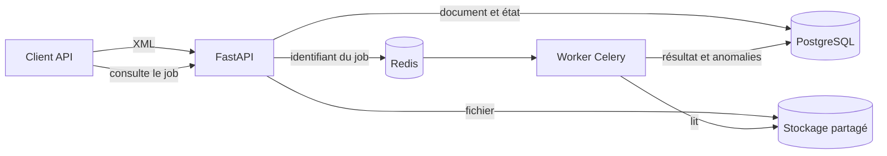

# Invoice Processing API

[](https://github.com/hschbonus/invoice-processing-api/actions/workflows/ci.yml)

API Python de démonstration qui reçoit des documents structurés, contrôle leurs
données et restitue un résultat normalisé. Le cas d'usage présenté est l'ingestion de
factures fournisseurs UBL fictives.

Il s'agit d'une étude de cas technique personnelle fondée sur un scénario et des
données fictifs. Le projet ne représente pas une mission client, ne constitue pas une
plateforme agréée et ne garantit aucune conformité fiscale.

## Le problème traité

Un système de gestion ne doit pas immobiliser une requête HTTP pendant l'analyse d'un
document fournisseur. Il doit accepter le fichier, conserver une trace du traitement,
absorber un incident temporaire et restituer des anomalies exploitables sans confondre
erreur technique et incohérence métier.

Cette étude de cas matérialise ce parcours sur un périmètre volontairement réduit :

1. recevoir et borner un fichier XML ;
2. identifier un doublon par son contenu ;
3. confier le traitement à un worker séparé ;
4. extraire et contrôler un sous-ensemble UBL ;
5. consulter un résultat normalisé ou relancer un échec.

## Ce que le projet démontre

- conception d'une API FastAPI documentée automatiquement avec OpenAPI ;
- persistance PostgreSQL et migrations Alembic ;
- séparation entre ingestion HTTP et traitement Celery ;
- idempotence par empreinte SHA-256 et à la nouvelle livraison d'une tâche ;
- reprises automatiques bornées et reprise manuelle contrôlée ;
- tests automatisés, qualité de code et parcours Docker vérifiés par CI.

## État actuel

Le socle FastAPI expose un endpoint de santé, un endpoint d'upload XML renvoyant
`202 Accepted` et un endpoint de consultation du résultat. Les documents et
traitements sont persistés avec SQLAlchemy. Le pipeline détecte les factures UBL,
extrait les données retenues et produit des anomalies structurées. Il fonctionne en
mode synchrone seul ou, dans l'environnement Docker, avec une file Celery/Redis et un
worker séparé.

## Besoin de marché observé

- La facture électronique française généralise les flux structurés et impose la
  réception à toutes les entreprises depuis le 1er septembre 2026 :
  https://www.economie.gouv.fr/tout-savoir-sur-la-facturation-electronique-pour-les-entreprises
- Les formats du socle sont UBL, CII et Factur-X :
  https://www.impots.gouv.fr/sites/default/files/media/1_metier/2_professionnel/EV/2_gestion/290_facturation_electronique/fiches_reforme/fiche-1_f_v.pdf
- Au 14 septembre 2026, Free-Work affiche 31 offres ou missions catégorisées FastAPI :
  https://www.free-work.com/fr/tech-it/jobs/fastapi
- La facturation électronique apparaît dans 44 offres ou missions, majoritairement
  fonctionnelles ou SI plutôt que strictement Python :
  https://www.free-work.com/fr/tech-it/jobs/facturation-electronique

Ces sources valident le problème et les compétences techniques, pas l'existence d'un
client pour ce projet ni l'intention d'en faire un produit commercial.

## Périmètre

### Inclus

- ingestion de factures UBL XML fictives ;
- traitement synchrone ou asynchrone avec suivi d'état ;
- contrôles de cohérence et anomalies structurées ;
- résultat JSON récupérable par API ;
- tests, conteneurisation simple, CI et documentation OpenAPI ;
- file de tâches Celery/Redis isolée du cœur du traitement.

### Hors périmètre

- transmission à l'administration ou à une plateforme agréée ;
- conseil fiscal ou garantie réglementaire ;
- comptabilité, paiement ou rapprochement bancaire ;
- interface frontend dédiée ;
- reconnaissance OCR propriétaire ;
- garantie de conformité UBL, Factur-X, CII ou EN 16931 ;
- RabbitMQ, Kubernetes et couche SQLAlchemy asynchrone.

## Stack

- FastAPI et Pydantic Settings ;
- PostgreSQL, SQLAlchemy synchrone et Alembic ;
- pytest et Ruff ;
- Docker Compose et GitHub Actions ;
- Celery 5.6 et Redis pour l'exécution en arrière-plan.

## Architecture



Redis transporte uniquement les messages. PostgreSQL reste la source de vérité pour
l'état et le résultat, ce qui évite de dépendre du backend de résultats Celery. Le
traitement reste une fonction Python indépendante : le mode `sync` permet de
l'exécuter sans broker, tandis que le mode `celery` change seulement la façon de le
déclencher.

| Décision | Pourquoi | Limite assumée |
|---|---|---|
| SQLAlchemy synchrone | Le travail lourd est sorti de la requête ; une couche SQL asynchrone n'apporterait pas de preuve utile ici | Les accès SQL restent bloquants dans chaque processus |
| Redis comme broker | Mise en route courte et lisible pour le démonstrateur | RabbitMQ serait à évaluer pour d'autres garanties d'exploitation |
| Stockage par volume partagé | Rend le flux local concret sans fournisseur cloud | À remplacer par un stockage objet pour plusieurs machines |
| Sous-ensemble UBL | Permet de démontrer parsing, normalisation et contrôles | Ce n'est pas une validation réglementaire complète |

## Installation

```powershell
poetry install
```

## Utilisation

```powershell
poetry run uvicorn app.main:app --reload
```

La documentation interactive sera disponible sur `http://127.0.0.1:8000/docs`.

La base attendue par défaut est PostgreSQL. Sa connexion et le stockage local sont
configurables avec `DATABASE_URL`, `STORAGE_DIR`, `MAX_UPLOAD_BYTES`,
`PROCESSING_MODE` et `CELERY_BROKER_URL` (voir `.env.example`). Sans configuration,
`PROCESSING_MODE=sync` garde un démarrage simple sans Redis.

```powershell
poetry run alembic upgrade head
```

L'upload est disponible via `POST /v1/documents`. Il accepte actuellement un fichier
XML de 5 Mio maximum et renvoie les identifiants du document et du traitement. Le
traitement est exécuté dans la requête en mode `sync` : le statut renvoyé est
`succeeded` ou `failed`. En mode `celery`, la réponse immédiate porte le statut
`queued`, puis le worker traite le document. `GET /v1/jobs/{job_id}` restitue son état
et son résultat. Deux uploads au contenu identique réutilisent le document et le
traitement existants ; la réponse l'indique avec `deduplicated: true`.

Le worker acquitte une tâche après son exécution et ne précharge qu'une tâche par
processus. Une tâche déjà réussie est ignorée si elle est livrée une seconde fois. Les
erreurs temporaires d'accès au stockage sont retentées trois fois avec un délai
exponentiel ; un document XML invalide échoue immédiatement, car le rejouer ne
changerait pas son contenu.

Un opérateur peut relancer explicitement un traitement en échec avec
`POST /v1/jobs/{job_id}/retry`. L'API refuse la relance d'un traitement en attente, en
cours ou déjà réussi avec une réponse `409 Conflict`.

```powershell
curl.exe -F "file=@samples/ubl/valid-invoice.xml;type=application/xml" `
  http://127.0.0.1:8000/v1/documents
```

## Sous-ensemble UBL pris en charge

Le parseur reconnaît une racine `Invoice` dans l'espace de noms officiel UBL et lit :

- numéro et date d'émission ;
- devise du document ;
- noms du fournisseur et du client ;
- montants net, taxe, brut et payable.

Il contrôle la présence de ces champs, le format de la date et de la devise, les
valeurs décimales et, dans le périmètre simplifié du démonstrateur, l'égalité
`net + taxe = brut`. Une facture lisible mais incohérente termine avec le statut
technique `succeeded` et le résultat métier `validation_status: invalid`. Un document
illisible ou qui n'est pas une facture UBL termine en `failed`.

Les trois fichiers de `samples/ubl/` sont fictifs et couvrent le cas valide pour ce
sous-ensemble, les anomalies métier et le XML mal formé. Leur structure reprend le
modèle de facture publié par OASIS :
https://docs.oasis-open.org/ubl/os-UBL-2.4/UBL-2.4.html

Le projet ne télécharge pas les schémas officiels et ne réalise pas de validation XSD,
EN 16931 ou fiscale.

## Vérification

```powershell
poetry run pytest
poetry run ruff check .
```

La suite compte actuellement 14 tests. La CI exécute également les migrations sur une
vraie instance PostgreSQL, construit l'image, démarre toute la stack Docker puis
vérifie un upload traité par le worker Celery.

## Exécution avec Docker

L'environnement conteneurisé démarre l'API, PostgreSQL, Redis et un worker Celery.
L'API applique les migrations avant son démarrage. Les données de la base, la file et
les documents déposés sont conservés dans des volumes séparés :

```powershell
docker compose up --build
```

L'API répond ensuite sur `http://127.0.0.1:8000`, avec sa documentation interactive
sur `http://127.0.0.1:8000/docs`. Les identifiants PostgreSQL présents dans
`compose.yaml` sont uniquement ceux de l'environnement local de démonstration. Le
worker Celery tourne dans un conteneur Linux : son exécution native sous Windows n'est
pas prise en charge officiellement par Celery.

Documentation de référence :

- https://docs.celeryq.dev/en/stable/getting-started/
- https://docs.celeryq.dev/en/v5.6.2/getting-started/backends-and-brokers/redis.html

### Parcours de démonstration

1. ouvrir `http://127.0.0.1:8000/docs` ;
2. envoyer `samples/ubl/valid-invoice.xml` avec `POST /v1/documents` ;
3. copier le `job_id` de la réponse `202 Accepted` ;
4. appeler `GET /v1/jobs/{job_id}` jusqu'au statut `succeeded` ;
5. comparer avec `invalid-business-invoice.xml` puis `malformed-invoice.xml` pour
   observer la différence entre anomalies métier et échec technique.

```powershell
docker compose down
```

## Suivi

Le backlog canonique est celui du projet parent : `../BACKLOG.md`, phase 2 (`P2.*`).
